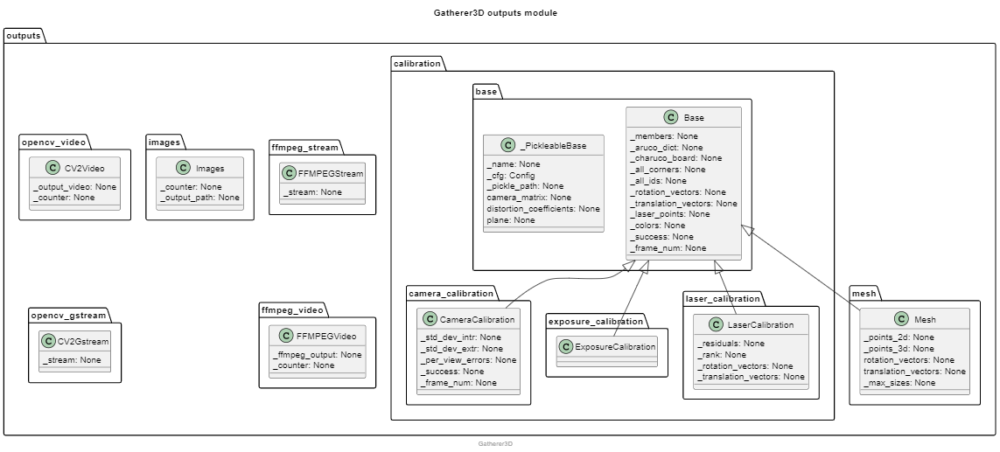
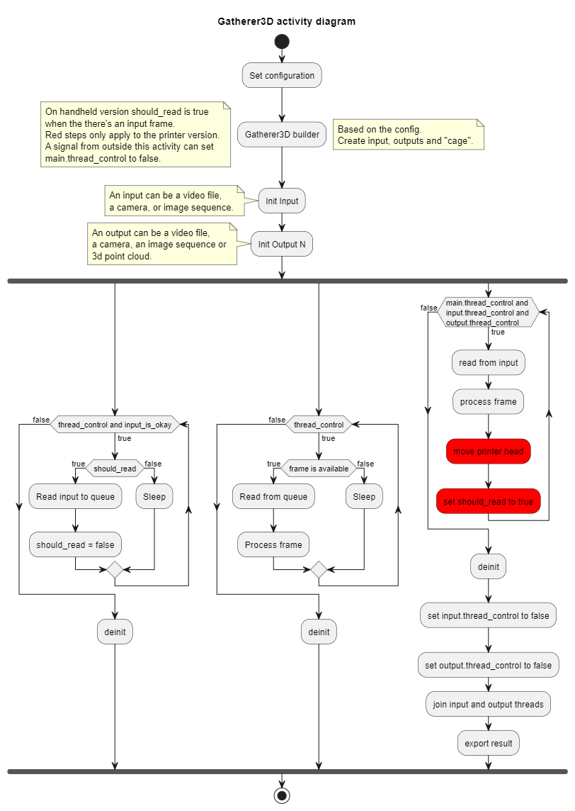

# Introduction
Raspberry Pi based 3D laser scanner.

## Example result:
Further results: ./docs/pcd_clean and ./docs/pcd_original and ./docs/results

## MARK III device:

# Installation

## Required models

Files to 3D print:
 - ./docs/frame_models/MARKIII-CORE.stl
 - ./docs/frame_models/MARKIII-LID.stl
 - ./docs/frame_models/MARKIII-TOP.stl

Default charuco board to print:
 - ./docs/calibration-board.png

With the proper configuration other board can be used.

## Required hardware
 - 1* Rasbperry Pi 4B 8GB (others should work but this is the one I have used)
 - 1* Raspberry Camera Module 2 with CSI cable
 - 1* 5V DC fan
 - 1* 5mW laser line projector
 - 4* M2.5 20mm screw with bolt
 - 4* M3 16mm screw with bolt 
 - Battery HAT (optional only for convinience, the device can be used with the standard power supply as well)

## Assembly
***Warning: be careful with the solder***

Place the CORE nuts and TOP nuts on top of the proper holes and apply heat to it. A solderer should do the trick. Too much heat could sink the nut too deep so be careful. (check out the [bottom right corner](#mark-iii-device) )

Push the laser through the tilted hole. If it's still wobly make use a bit of tape :)
Attach the raspberry to the printed CORE with the screws.
Attach the battery HAT if you have one.
Connect the laser and camera to the device. Default laser pin is GPIO14 but this can be changed in the configs.
Put your camera in place as well and roll up the remaining cable. Push down the LID behind the camera.
Push the TOP into place and connect the fan before screwing it on top of the TOP part.
For further help check out the provided images from the [Introduction](#introduction).

## Required software

### OS and other base softwares
 - Raspberry Pi OS (64-bit) (Bullseye)
 - OpenCV with contrib (aruco and GStream) >= 4.5
### Required python packages:
 - numpy
 - open3d
 - opencv
 - autopep8
 - ffmpeg
 - picamera2
 - RPI.GPIO
### Other required software
 - rtsp-simple-server
### Software for documentation
 - radon
 - cProfile
 - snakeviz
 - plantuml
### VSCode plugins
 - The list of recommended plugins can be found in .vscode/extensions.json

## Usage
### How to run
´´´
python main.py
´´´
With Ctrl+C you can terminate the program which whill save the output to the correct file.

### Calbiration
1. Put the charuco board on a flat surface.
2. Calibrate the camera. To do this select a calbiration structure with proper settings and run the program.
3. Calibrate the laser plane. Same as the previous point except instead of Camera calibration now select a Laser calibration structure.
4. Set up your scan config structure according to the comments For further info see: ./source/core/config_constants.py and ./source/core/config_types.py.
5. And scan your object.

For further results and documentation check out ./docs/ and the code comments.

# Code analysis and Architecture

## Metrics
Source:
 - https://pypi.org/project/radon/
 - https://radon.readthedocs.io/en/latest/commandline.html

´´´
radon raw source -s > ./docs/raw.txt
radon cc source > ./docs/cc.txt
radon mi source > ./docs/mi.txt
python -m cProfile ./source/main.py > ./docs/analysis/cProfile.txt
python -m cProfile -o ./docs/analysis/cProfile.prof ./source/main.py
python -m snakeviz ./docs/analysis/cProfile.prof
´´´
Results: ./docs/analysis

## Architecture
Check out ./docs/architecture/

# Sources and useful links
TODO